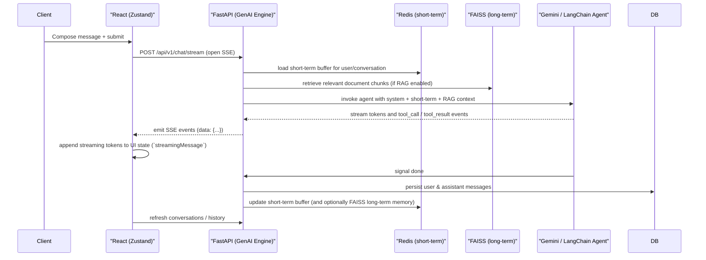

# GenAI Engine

**GenAI Engine** is a full-stack, production-ready AI assistant platform you can self-host. It pairs a **FastAPI** backend (Google **Gemini** + **LangChain** tool calling, **RAG**, memory, and optional voice) with a **React** web console styled as a dark HUD. Data remains under your control: **PostgreSQL** for accounts and chat history, **Redis** for caching and rate limits, and **FAISS** on disk for vector search.

---

## Table of contents

1. [What GenAI Engine does](#what-genai-engine-does)
2. [Key capabilities](#key-capabilities)
3. [Architecture](#architecture)
4. [Technology stack](#technology-stack)
5. [Repository layout](#repository-layout)
6. [Prerequisites](#prerequisites)
7. [Getting started (Docker — recommended)](#getting-started-docker--recommended)
8. [Getting started (local, without Docker)](#getting-started-local-without-docker)
9. [Using the application](#using-the-application)
10. [HTTP API reference](#http-api-reference)
11. [Streaming protocol (SSE)](#streaming-protocol-sse)
12. [Security and safety](#security-and-safety)
13. [Production deployment](#production-deployment)
14. [Testing and CI](#testing-and-ci)
15. [Configuration](#configuration)
16. [Make targets](#make-targets)
17. [Troubleshooting](#troubleshooting)
18. [Extending GenAI Engine (adding a tool)](#extending-genai-engine-adding-a-tool)
19. [License](#license)

---

## What GenAI Engine does

GenAI Engine is designed to provide a flexible, self-hosted AI assistant platform with:

- **Multi-turn chat** with **server-sent events (SSE)** streaming so tokens appear as they are generated.
- **Retrieval-augmented generation (RAG)**: upload PDF, TXT, DOCX, or Markdown; chunks are embedded with **Gemini embeddings** and stored in a **per-user FAISS** index. Answers can cite document context.
- **Agent tools** the model can invoke: web search (DuckDuckGo), sandboxed file read/write, HTTP calls to an **allowlisted** domain set, and a **strictly allowlisted** set of shell commands.
- **Memory**: short-term context in **Redis** (with optional summarization when the buffer grows), plus **long-term** conversational snippets indexed in FAISS.
- **Optional voice**: **faster-whisper** (local) for speech-to-text; **ElevenLabs** for speech synthesis when an API key is present, with **pyttsx3** fallback.

The **web UI** supports authentication, conversation sidebar, document upload, RAG toggle, streaming markdown replies, tool-call cards, and a voice capture button.

---

## Key capabilities

| Area | Details |
|------|---------|
| **Auth** | Register/login; **JWT** access + refresh tokens; passwords hashed with **bcrypt** |
| **Chat** | Streaming replies; persisted **conversations** and **messages**; optional `tool_calls` on assistant messages |
| **RAG** | Ingest → chunk → embed → FAISS; keyword search-style **retrieve** API; MMR-style diversity in retrieval |
| **Tools** | `web_search`, `file_read` / `file_write` (per-user workspace), `api_call` (domain whitelist), `system_command` (command whitelist) |
| **Voice** | `POST /voice/transcribe`, `POST /voice/synthesize` |
| **Ops** | **Docker Compose** (Postgres, Redis, Gunicorn/Uvicorn API, Nginx frontend); **Alembic** migrations; health checks; structured JSON logs with request IDs; Redis sliding-window rate limiting; GitHub Actions CI |

---

## Architecture

### High-level diagram

```
┌─────────────────────────────────────────────────────────────────────────────┐
│                              Client (Browser)                                │
│  React 18 · Vite · TypeScript · Tailwind · Zustand · SSE (EventSource/fetch) │
└─────────────────────────────────────────────────────────────────────────────┘
         │  HTTPS (dev: HTTP)
         │  REST JSON  ·  POST /api/v1/chat/stream (text/event-stream)
         ▼
┌─────────────────────────────────────────────────────────────────────────────┐
│                    Nginx (frontend container, :3000 → :80)                     │
│  · Serves SPA static assets                                                    │
│  · Proxies /api/ → backend (buffering OFF for SSE)                           │
└─────────────────────────────────────────────────────────────────────────────┘
         │  proxy /api/ …
         ▼
┌─────────────────────────────────────────────────────────────────────────────┐
│                     FastAPI — GenAI Engine API (backend :8000)               │
│  ┌─────────────┐  ┌──────────────┐  ┌───────────────┐  ┌─────────────────┐ │
│  │ Auth router │  │ Chat router  │  │ Voice router  │  │ RAG router      │ │
│  └──────┬──────┘  └──────┬───────┘  └───────┬───────┘  └────────┬────────┘ │
│         │                │                   │                    │           │
│         └────────────────┴─────────────────┴────────────────────┘           │
│                                    │                                          │
│  ┌─────────────────────────────────▼──────────────────────────────────────┐ │
│  │ LLMService — ChatGoogleGenerativeAI + LangChain AgentExecutor            │ │
│  │ · System prompt: user, time, RAG context, memories, rules              │ │
│  │ · Tools: search, files, api_call, system_command                        │ │
│  └─────────────────────────────────────────────────────────────────────────┘ │
│  ┌──────────────────────┐  ┌──────────────────────┐  ┌─────────────────────┐ │
│  │ MemoryService         │  │ RAGService           │  │ VoiceService        │ │
│  │ · Redis short-term    │  │ · Ingest / retrieve  │  │ · Whisper / TTS     │ │
│  │ · FAISS long-term     │  │ · FAISS + metadata   │  │ · Redis TTS cache   │ │
│  └──────────────────────┘  └──────────────────────┘  └─────────────────────┘ │
│  Middleware: CORS · structured logging · Redis sliding-window rate limit        │
└─────────────────────────────────────────────────────────────────────────────┘
         │                              │                        │
         ▼                              ▼                        ▼
┌─────────────────┐          ┌─────────────────┐      ┌──────────────────────┐
│   PostgreSQL    │          │     Redis       │      │  FAISS + JSON meta   │
│ users, chats,   │          │ sessions, mem,  │      │  under FAISS_INDEX_  │
│ messages, docs  │          │ rate limit, TTS │      │  DIR (per user)      │
└─────────────────┘          └─────────────────┘      └──────────────────────┘
```

### Data flow (chat with RAG)

1. The client sends a **POST** to `/api/v1/chat/stream` with the user message and optional `conversation_id`.
2. The backend loads **short-term** and **long-term** memory, and if RAG is enabled, **retrieves** relevant chunks from the user’s document index.
3. **Gemini** runs inside an **agent** loop; tool calls and text stream out as **SSE** frames.
4. The user's message is **persisted before** the model runs. The assistant reply is persisted when the stream ends — including a partial reply (marked as interrupted) if the agent fails or the client disconnects mid-stream. On success, **Redis** short-term memory and **FAISS** long-term memory are updated.

### Chat pipeline (sequence diagram + walkthrough)

Below is a concise sequence diagram that shows the runtime flow for a chat turn (SSE streaming) followed by an annotated walkthrough with links to the key implementation files.



Annotated walkthrough (key files):

- **Client / Frontend state and streaming**: `useChatStore` manages `streamingMessage`, `messages`, `isStreaming`, `activeToolCalls`, and optimistic updates. See [frontend/src/store/chatStore.ts](frontend/src/store/chatStore.ts#L1-L220).
- **Authentication state**: `useAuthStore` keeps `user` and `accessToken` client-side; the refresh token is stored in session storage. See [frontend/src/store/authStore.ts](frontend/src/store/authStore.ts#L1-L120).
- **SSE endpoint and routing**: the chat router and SSE stream are exposed under `/api/v1/chat/stream` (see [backend/routers/chat.py](backend/routers/chat.py)).
- **DB sessions**: routers use a request-scoped async SQLAlchemy session; the chat stream opens its own session because a dependency's session is closed before a `StreamingResponse` finishes. See [backend/db/session.py](backend/db/session.py).
- **Short-term memory (Redis)**: `MemoryService` reads/writes recent messages into Redis buffers, summarizes when buffers grow, and returns role/content pairs for prompt context. See [backend/services/memory_service.py](backend/services/memory_service.py#L1-L220).
- **Long-term memory and RAG**: `RagService` handles ingestion, per-user FAISS indexes, and retrieval of document chunks. Both it and `MemoryService` store vectors through `FaissStore`, which serializes writers with a per-user file lock and writes files atomically. See [backend/services/rag_service.py](backend/services/rag_service.py) and [backend/utils/faiss_store.py](backend/utils/faiss_store.py).
- **LLM & agent orchestration**: LLM/agent invocation and tool registration occur in the LLM service / agent executor (see [backend/services/llm_service.py](backend/services/llm_service.py)).
- **Redis client and lifecycle**: shared async Redis client setup and graceful shutdown. See [backend/redis_client.py](backend/redis_client.py#L1-L80).
- **App startup and directories**: FAISS and workspace directories are created at startup; health checks exposed at `/health`. See [backend/main.py](backend/main.py).

### External services

| Service | Role |
|---------|------|
| **Google Gemini** | Chat completions and text embeddings (API key required) |
| **DuckDuckGo** | Web search from the `web_search` tool (no API key) |
| **ElevenLabs** | Optional cloud TTS |
| **Internet** | Only where you allow it (`api_call` domains, `web_search`) |

---

## Technology stack

| Layer | Technologies |
|--------|--------------|
| **Backend** | Python 3.11, FastAPI, Gunicorn + Uvicorn workers, SQLAlchemy 2 (async), Alembic, asyncpg, Pydantic v2 |
| **AI** | `langchain`, `langchain-google-genai`, `langchain-core`, Google Generative AI SDK |
| **Vectors** | `faiss-cpu`, on-disk indexes guarded by `filelock`; Gemini `gemini-embedding-001` |
| **Data** | PostgreSQL 16, Redis 7 |
| **Auth** | `python-jose[cryptography]`, `passlib[bcrypt]` |
| **Voice** | `faster-whisper`, `pydub`, `elevenlabs`, `pyttsx3` |
| **Frontend** | React 18, Vite 5, TypeScript (strict), Tailwind CSS, Zustand, Axios, react-markdown |
| **Containers** | Docker, Docker Compose (production file + dev overlay); frontend image uses Nginx |
| **Quality** | pytest (+ pytest-asyncio), black, isort, GitHub Actions |

---

## Repository layout

```
genai-engine/
├── backend/                 # FastAPI application
│   ├── main.py              # App entry, lifespan, middleware, routers
│   ├── config.py            # Settings from .env
│   ├── dependencies.py      # DB session, Redis, current user
│   ├── models/              # SQLAlchemy models
│   ├── schemas/             # Pydantic request/response models
│   ├── routers/             # auth, chat, voice, rag
│   ├── services/            # auth, llm, memory, rag, voice
│   ├── tools/               # LangChain tools
│   ├── db/                  # engine, session, Base
│   ├── middleware/          # logging (request IDs), rate limiting
│   ├── utils/               # chunking, embeddings, FAISS store, SSE helpers
│   ├── alembic/             # database migrations
│   └── tests/               # pytest suite (no network, no API key needed)
├── frontend/                # React SPA
│   └── src/                 # components, api, hooks, stores, styles
├── .github/workflows/ci.yml # lint, tests, frontend build, Docker builds
├── docker-compose.yml       # production stack
├── docker-compose.dev.yml   # dev overlay: hot reload + published ports
├── .env.example
├── Makefile
└── README.md
```

---

## Prerequisites

- **Docker Desktop** (or Docker Engine + Compose v2) for the recommended path.
- A **Google AI Studio** API key for Gemini: [https://aistudio.google.com](https://aistudio.google.com)

Optional:

- **ElevenLabs** API key for higher-quality TTS (otherwise pyttsx3 WAV fallback is used when synthesizing).

---

## Getting started (Docker — recommended)

1. **Clone** the repository and enter the project root.

2. **Create environment file:**

   ```bash
   cp .env.example .env
   ```

3. **Edit `.env`** and set at minimum:

   - `GEMINI_API_KEY` — your Gemini key
   - `JWT_SECRET_KEY` — random secret of at least 32 characters (`make key` or `openssl rand -hex 32`)
   - `POSTGRES_PASSWORD` — random letters and digits

   Compose sets `DATABASE_URL`, `REDIS_URL`, `USE_FAKE_REDIS=false` and `ENVIRONMENT=production` for the backend container. Other variables are read from `.env`.

4. **Start the stack:**

   ```bash
   make up          # or: docker compose up -d --build
   ```

   The backend container runs `alembic upgrade head` on start, then serves the API with Gunicorn.

5. **Open the app** at [http://localhost:3000](http://localhost:3000) (`HTTP_PORT` in `.env`). Only this port is published; Postgres, Redis and the API stay on the internal Docker network. Health: [http://localhost:3000/health](http://localhost:3000/health).

6. **First run:** register an account in the UI, then start chatting. Upload documents under **Knowledge Base** when you want RAG.

### Development mode (hot reload)

```bash
make dev   # docker compose -f docker-compose.yml -f docker-compose.dev.yml up --build
```

This mounts `backend/` into the container, runs Uvicorn with `--reload`, sets `ENVIRONMENT=development` (Swagger at [http://localhost:8000/docs](http://localhost:8000/docs)), and publishes ports 8000, 5432 and 6379.

---

## Getting started (local, without Docker)

The quickest local setup needs no database or Redis server: the `.env.example` defaults use **SQLite** and in-process **fakeredis** (`USE_FAKE_REDIS=true`).

1. **Backend:**

   ```bash
   cd backend
   python -m venv .venv
   .venv\Scripts\activate          # Windows
   # source .venv/bin/activate     # macOS/Linux
   pip install -r requirements.txt
   alembic upgrade head            # create/upgrade the schema
   uvicorn main:app --reload --host 0.0.0.0 --port 8000
   ```

   To use Postgres and Redis instead, point `DATABASE_URL` at `postgresql+asyncpg://...`, set `USE_FAKE_REDIS=false`, and run `alembic upgrade head` again.

2. **Frontend:**

   ```bash
   cd frontend
   npm install
   npm run dev
   ```

   Vite serves on **port 3000** and proxies `/api` to `http://localhost:8000`.

### Windows note (native `pip install`)

Some dependencies may ship **source distributions** that require **Visual Studio Build Tools** (C++ workload) or **Rust** toolchain. If `pip install` fails building wheels (e.g. `av`, `pyreqwest-impersonate`), prefer **Docker** or **WSL2** for the backend, or install [Build Tools for Visual Studio](https://visualstudio.microsoft.com/visual-cpp-build-tools/).

**Dependency notes:** `langchain-google-genai` expects `google-generativeai` in the **0.5.x** range, and `passlib` 1.7.4 needs `bcrypt` 4.0.x; the pinned requirements follow both constraints.

---

## Using the application

### Web UI

1. **Sign in / Create account** — JWT access token is kept in memory; refresh token in `sessionStorage`.
2. **New Chat** — starts a thread; title updates from your first message.
3. **Sidebar** — switch conversations, delete threads, toggle **RAG**, upload/list documents.
4. **Composer** — type a message; **Enter** sends, **Shift+Enter** newline; **voice** button records via the microphone (browser permission required).
5. **Streaming** — assistant text streams in; **tool** cards show when the agent calls a tool.

### Developer API usage

- Obtain tokens via `POST /api/v1/auth/login` or `register`.
- Send `Authorization: Bearer <access_token>` on protected routes.
- For streaming, use a client that reads **SSE** lines starting with `data: ` (see below).

---

## HTTP API reference

Base path for versioned routes: **`/api/v1`**.  
**`GET /health`** is not under `/api/v1`.

### Auth (`/api/v1/auth`)

| Method | Path | Description |
|--------|------|-------------|
| POST | `/register` | Create account; returns tokens + user |
| POST | `/login` | JSON body: `email`, `password` |
| POST | `/refresh` | Body: `refresh_token` → new `access_token` |
| GET | `/me` | Current user (Bearer required) |

**Register example:**

```json
POST /api/v1/auth/register
Content-Type: application/json

{
  "email": "ada@example.com",
  "password": "minimum8chars",
  "name": "Ada Lovelace"
}
```

**Response (abbreviated):**

```json
{
  "access_token": "eyJ...",
  "refresh_token": "eyJ...",
  "token_type": "bearer",
  "user": {
    "id": "uuid",
    "email": "ada@example.com",
    "name": "Ada Lovelace",
    "timezone": "UTC",
    "created_at": "2026-05-05T12:00:00Z"
  }
}
```

### Chat (`/api/v1/chat`)

| Method | Path | Description |
|--------|------|-------------|
| POST | `/stream` | SSE stream for assistant reply (Bearer, JSON body) |
| GET | `/conversations` | List conversations with message counts |
| GET | `/history/{conversation_id}` | Ordered messages |
| DELETE | `/conversation/{conversation_id}` | Delete thread and messages |

**Stream request body:**

```json
{
  "message": "What did I upload about the project timeline?",
  "conversation_id": null,
  "rag_enabled": true,
  "voice_mode": false
}
```

`conversation_id` may be omitted or `null` to start a **new** conversation.

### Voice (`/api/v1/voice`)

| Method | Path | Description |
|--------|------|-------------|
| POST | `/transcribe` | `multipart/form-data` field **`file`** (audio) |
| POST | `/synthesize` | JSON `{"text": "..."}` (max 2000 chars); returns audio bytes |

### RAG (`/api/v1/rag`)

| Method | Path | Description |
|--------|------|-------------|
| POST | `/upload` | Multipart **`file`** — PDF, TXT, DOCX, MD; max **50 MB** |
| GET | `/documents` | List user documents |
| DELETE | `/document/{doc_id}` | Remove document and vectors |
| GET | `/search?q=...` | Semantic search over ingested chunks |

### Health

**`GET /health`**

Example response shape:

```json
{
  "status": "healthy",
  "version": "1.0.0",
  "model": "gemini-2.5-flash",
  "db": "connected",
  "redis": "connected"
}
```

`status` may reflect **degraded** if a dependency check fails.

---

## Streaming protocol (SSE)

The stream returns **`text/event-stream`**. Each event is a line:

```text
data: <JSON>\n\n
```

JSON envelope:

```json
{
  "type": "token | tool_call | tool_result | done | error",
  "data": "string or object"
}
```

| `type` | `data` meaning |
|--------|----------------|
| `token` | Partial assistant text (string) |
| `tool_call` | `{ "name": "...", "input": { ... } }` |
| `tool_result` | `{ "name": "...", "output": "..." }` (truncated in stream) |
| `done` | `{ "conversation_id": "...", "message_id": "..." }` |
| `error` | User-safe error message string (details are logged server-side with the request ID) |

Clients should keep the connection open until `done` or `error`. A request for a conversation that does not exist or belongs to another user fails with HTTP **404** before the stream starts.

---

## Security and safety

- **Secrets** must live in `.env` or a secret manager — do not commit real keys. In production the app refuses to start with a short or placeholder `JWT_SECRET_KEY`, with in-process Redis, or with a wildcard CORS origin.
- **Passwords** are hashed with `bcrypt_sha256`, so the whole password counts (plain bcrypt ignores bytes after 72).
- **JWT** access tokens are short-lived. Refresh tokens are only honoured for users that still exist and are active.
- **Rate limiting** is a Redis sliding window per user id (from the JWT) or client IP; Gunicorn trusts Nginx's `X-Forwarded-For` so IPs are real. Rejected requests get `429` with `Retry-After`.
- **Ownership checks**: conversations and documents of other users return `404`.
- **File tools** are scoped to **`WORKSPACE_DIR/<user_id>`** with path sanitization.
- **`api_call`** only allows hostnames listed in **`ALLOWED_API_DOMAINS`**.
- **`system_command`** only allows a fixed whitelist (`ls`, `pwd`, `echo`, `date`, `whoami`, `df`, `du`), runs inside the user's workspace, and rejects absolute paths, `~` and `..`.
- **Nginx** sends `X-Content-Type-Options`, `X-Frame-Options` and `Referrer-Policy` headers; API docs (`/docs`, `/openapi.json`) are disabled in production.
- **CORS** is configurable via **`CORS_ORIGINS`**.

Still your responsibility when deploying: TLS termination in front of Nginx, secret rotation, backups of the Postgres and FAISS volumes, and network policies for your environment.

---

## Production deployment

`docker-compose.yml` is the production stack:

| Concern | How it is handled |
|---------|-------------------|
| Schema | `docker-entrypoint.sh` runs `alembic upgrade head` before the server starts |
| App server | Gunicorn supervising `WEB_CONCURRENCY` Uvicorn workers; graceful shutdown |
| Health | Docker `HEALTHCHECK` on `/health` (checks DB and Redis); Nginx waits for a healthy API |
| Restarts | `restart: unless-stopped` on every service |
| Exposure | Only Nginx is published; Postgres/Redis/API are internal |
| Persistence | Named volumes for Postgres, Redis (AOF enabled), FAISS indexes and workspaces |
| Concurrency | FAISS index + metadata writes are serialized with a per-user file lock and written atomically, so multiple workers are safe |
| Observability | JSON logs in production; each request gets an `X-Request-ID` that appears in every log line for that request |
| Uploads | Nginx `client_max_body_size` matches the backend's 50 MB limit |

**Schema changes:** edit the models, then `make migration m="describe change"`, review the generated file in `backend/alembic/versions/`, and commit it. A test fails if models and migrations drift apart.

**Upgrading an existing database created before migrations existed:** run `alembic stamp 0001` once, then `alembic upgrade head`.

---

## Testing and CI

```bash
cd backend
python -m pytest          # or: make test
```

The suite uses a temporary SQLite database, fakeredis, a deterministic fake embedder and a scripted fake agent, so it needs **no network and no API key**. It covers:

- **Auth** — registration, login, token types, refresh for deactivated users, long-password hashing
- **Chat** — SSE event order, persistence, tool-call storage, history passed to the agent, failures and client disconnects keeping partial replies, cross-user access (404), deletion clearing memories, short-term memory summarization
- **RAG** — chunking, ingestion, retrieval relevance and isolation, MMR diversity, deletion, background upload, concurrent ingestion consistency
- **Tools** — workspace isolation, path traversal, command and domain allowlists
- **Platform** — health, request IDs, rate limiting, production config guards, migrations matching the models (upgrade + downgrade)

GitHub Actions ([.github/workflows/ci.yml](.github/workflows/ci.yml)) runs `black`/`isort` checks and the tests, type-checks and builds the frontend, validates both compose files, and builds both Docker images on every push to `main` and every pull request.

---

## Configuration

All major settings are documented in **`.env.example`**. Summary:

| Variable | Purpose |
|----------|---------|
| `GEMINI_API_KEY` | Required — Gemini API access |
| `GEMINI_MODEL` | Default `gemini-2.5-flash` |
| `EMBEDDING_MODEL` | Default `models/gemini-embedding-001` (changing it requires re-indexing documents) |
| `DATABASE_URL` | Async SQLAlchemy URL — `sqlite+aiosqlite:///...` locally, `postgresql+asyncpg://...` in production |
| `REDIS_URL` / `USE_FAKE_REDIS` | Redis connection URL / use in-process fakeredis (development only) |
| `JWT_SECRET_KEY` | Required — signing key for JWTs (≥ 32 chars in production) |
| `JWT_ALGORITHM` | Default `HS256` |
| `ACCESS_TOKEN_EXPIRE_MINUTES` / `REFRESH_TOKEN_EXPIRE_DAYS` | Token lifetimes |
| `ELEVENLABS_API_KEY` / `ELEVENLABS_VOICE_ID` | Optional TTS |
| `WHISPER_MODEL` | faster-whisper model id (e.g. `base.en`) |
| `FAISS_INDEX_DIR` | Vector index root |
| `WORKSPACE_DIR` | Per-user file tool sandbox root |
| `ALLOWED_API_DOMAINS` | Comma-separated hostnames for `api_call` |
| `CHUNK_SIZE` / `CHUNK_OVERLAP` / `MAX_RAG_RESULTS` | RAG tuning |
| `CORS_ORIGINS` | Comma-separated allowed browser origins |
| `RATE_LIMIT_REQUESTS` / `RATE_LIMIT_WINDOW_SECONDS` | Throttling |
| `ENVIRONMENT` | `development` or `production` (JSON logs, no API docs, startup safety checks) |
| `LOG_LEVEL` | e.g. `INFO` |
| `POSTGRES_PASSWORD` | Required by Docker Compose |
| `HTTP_PORT` / `WEB_CONCURRENCY` | Published web port / Gunicorn worker count (Docker) |

---

## Make targets

| Target | Description |
|--------|-------------|
| `make up` | Build and start the production stack in the background |
| `make down` | Stop the stack |
| `make logs` | Tail backend logs |
| `make dev` | Development stack with hot reload and published ports |
| `make test` | Run the backend test suite |
| `make lint` / `make format` | Check / apply `black` + `isort` |
| `make migrate` | `alembic upgrade head` against `DATABASE_URL` |
| `make migration m="..."` | Autogenerate a migration from model changes |
| `make shell-backend` / `make shell-db` | Shell in the API container / `psql` into Postgres |
| `make clean` | **Destructive** — stops the stack and deletes all volumes |
| `make key` | Print a random 32-byte hex secret |

---

## Troubleshooting

| Issue | Suggestion |
|-------|------------|
| UI loads but API errors | Check backend logs; verify `GEMINI_API_KEY` and DB/Redis from `/health`. |
| SSE stalls behind proxy | Ensure **proxy_buffering off** (Nginx config in `frontend/nginx.conf` does this for `/api/`). |
| Database connection refused in Docker | Wait for Postgres healthcheck; confirm Compose `DATABASE_URL` override for `backend`. |
| Windows `pip install` fails | Use Docker, or install MSVC Build Tools / use WSL2 (see [Getting started local](#getting-started-local-without-docker)). |
| RAG returns empty | Ensure documents show `ready`; embeddings need valid Gemini key; check `FAISS_INDEX_DIR` permissions and mounts. |
| Upload fails with "Embedding dimension mismatch" | The embedding model changed. Delete `FAISS_INDEX_DIR/<user_id>/docs` (and `memory`) and re-upload. |
| Backend exits with "Unsafe production configuration" | Fix the listed settings (`JWT_SECRET_KEY`, `USE_FAKE_REDIS`, `CORS_ORIGINS`). |
| `alembic upgrade` says a table already exists | The database predates migrations: run `alembic stamp 0001` once. |

---

## Extending GenAI Engine (adding a tool)

1. Add a new **`BaseTool`** under `backend/tools/` with a clear **description** and **Pydantic `args_schema`** (so the model knows exact inputs).
2. Register the tool in **`LLMService._get_tools`** in `backend/services/llm_service.py` (respect per-user tools where needed).
3. **Sandbox** any filesystem or network access (reuse patterns from `file_ops.py` / `api_caller.py`).
4. **Update** this README if the tool is user-visible or needs new **environment variables**.
5. Rebuild/redeploy the backend; the UI **ToolCallCard** maps common tool names to icons — extend `frontend/src/components/ToolCallCard.tsx` if you want a dedicated icon/label.

---

## License

MIT

---

*GenAI Engine — local-first assistant with Gemini, RAG, and optional voice.*
